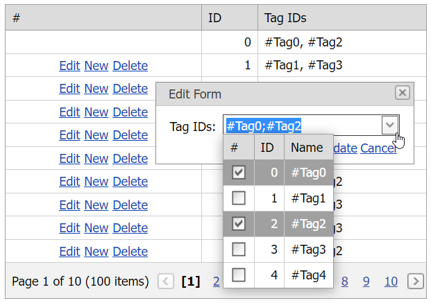

<!-- default badges list -->

[](https://supportcenter.devexpress.com/ticket/details/E3981)
[](https://docs.devexpress.com/GeneralInformation/403183)
<!-- default badges end -->
# Grid View for ASP.NET Web Forms - How to use a grid lookup control in multiple selection mode to edit grid data

This example demonstrates how to add a grid lookup control in multiple selection mode to the grid's edit form template.



## Overview

When the [ASPxGridLookup](https://docs.devexpress.com/AspNet/DevExpress.Web.ASPxGridLookup) control is in multiple selection mode (the [GridLookup.SelectionMode](https://docs.devexpress.com/AspNet/DevExpress.Web.ASPxGridLookup.SelectionMode) property is set to `Multiple`), use the following API members to access the selected items:

* The grid's [ASPxGridBase.GetSelectedFieldValues](https://docs.devexpress.com/AspNet/DevExpress.Web.ASPxGridBase.GetSelectedFieldValues(System.String--)) method to get the selected field values.
* The grid's [ASPxGridView.Selection](https://docs.devexpress.com/AspNet/DevExpress.Web.ASPxGridView.Selection) property to select items.

```aspx
<dx:ASPxGridView ID="Grid" runat="server" AutoGenerateColumns="False" KeyFieldName="ID" ... >
    <Columns>
        <!-- ... -->
        <dx:GridViewDataColumn FieldName="TagIDs">
            <EditItemTemplate>
                <dx:ASPxGridLookup ID="Lookup" runat="server" AutoGenerateColumns="false" DataSourceID="LookupDataSource"
                    KeyFieldName="ID" SelectionMode="Multiple" OnInit="Lookup_Init" TextFormatString="{1}">
                    <Columns>
                        <dx:GridViewCommandColumn ShowSelectCheckbox="true" VisibleIndex="0" />
                        <!-- ... -->
                    </Columns>
                </dx:ASPxGridLookup>
            </EditItemTemplate>
        </dx:GridViewDataColumn>
    </Columns>
    <SettingsEditing EditFormColumnCount="1" Mode="PopupEditForm" PopupEditFormWidth="200" />
</dx:ASPxGridView>
```

```cs
protected void Lookup_Init(object sender, EventArgs e) {
    var lookup = (ASPxGridLookup)sender;
    var container = (GridViewEditItemTemplateContainer)lookup.NamingContainer;

    if (container.Grid.IsNewRowEditing)
        return;

    var tagIDs = (int[])container.Grid.GetRowValues(container.VisibleIndex, container.Column.FieldName);
    if(tagIDs != null) {
        foreach(var tagID in tagIDs)
            lookup.GridView.Selection.SelectRowByKey(tagID);
    }
}

private int[] GetTags() {
    var column = (GridViewDataColumn)Grid.Columns["TagIDs"];
    var lookup = (ASPxGridLookup)Grid.FindEditRowCellTemplateControl(column, "Lookup");
    var tags = lookup.GridView.GetSelectedFieldValues(lookup.KeyFieldName) as List<object>;

    return tags.Select(t => (int)t).ToArray();
}
```

## Files to Review

* [Default.aspx](./CS/WebSite/Default.aspx) (VB: [Default.aspx](./VB/WebSite/Default.aspx))
* [Default.aspx.cs](./CS/WebSite/Default.aspx.cs) (VB: [Default.aspx.vb](./VB/WebSite/Default.aspx.vb))

## Documentation

* [Grid Lookup Selection Modes](https://docs.devexpress.com/AspNet/9075/components/grid-view/concepts/aspxgridlookup/selection-modes)

## More Examples

* [Grid View for ASP.NET MVC - How to use a grid lookup control in single selection mode to edit grid data](https://github.com/DevExpress-Examples/gridview-how-to-use-gridlookup-with-single-selection-mode-in-editform-t328413)
* [Grid View for ASP.NET MVC - How to use a grid lookup control in multiple selection mode to edit grid data](https://github.com/DevExpress-Examples/gridview-how-to-use-gridlookup-in-editform-in-multiple-selection-mode-t328613)
